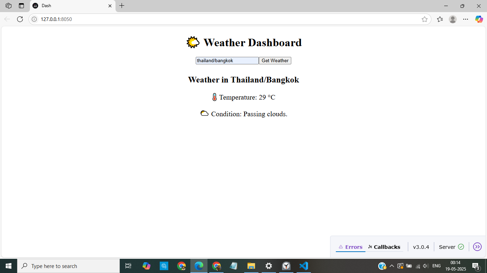

# WebDashApp
# 🌤️ Weather Dashboard

An interactive weather dashboard built using Python and Dash that allows users to fetch real-time weather information for any city.

## 🔧 Features
- Input any city in the format: `country/city` (e.g., `india/mumbai`)
- Scrapes live weather data (temperature and condition) from [timeanddate.com](https://www.timeanddate.com/weather/)
- Real-time update of weather info using Dash callbacks
- Clean, responsive layout with basic error handling

## 📸 Demo
  <!-- Add a screenshot of your running app -->

## 🛠️ Tech Stack
- Python
- Dash (Plotly)
- BeautifulSoup (bs4)
- Requests
- HTML/CSS

## 🚀 Getting Started

### 1. Clone the repository
```bash
git clone https://github.com/yourusername/weather-dashboard.git
cd weather-dashboard
